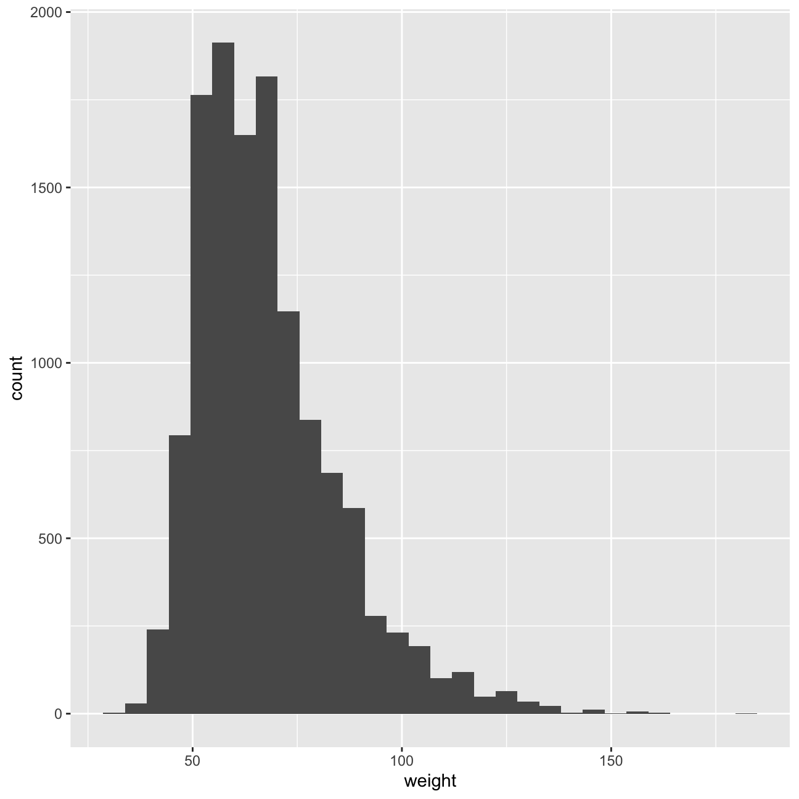
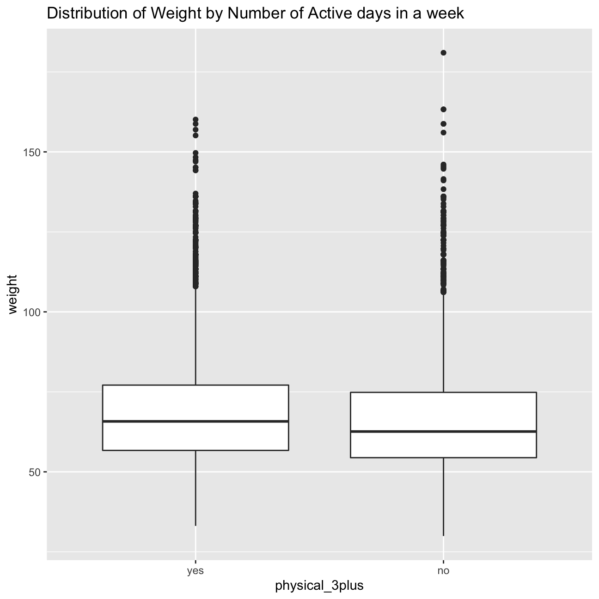

---
categories:
- ""
- ""
date: "2017-10-31T22:26:09-05:00"
description:
draft: false
image: inflation.jpeg
keywords: ""
slug: youth
title: Lets see what is influencing the youth!
---


# Youth Risk Behavior Surveillance

Every two years, the Centers for Disease Control and Prevention conduct the [Youth Risk Behavior Surveillance System (YRBSS)](https://www.cdc.gov/healthyyouth/data/yrbs/index.htm) survey, where it takes data from high schoolers (9th through 12th grade), to analyze health patterns. We worked with a selected group of variables from a random sample of observations during one of the years the YRBSS was conducted.

## Load the data

This data is part of the `openintro` textbook and we can load and inspect it. There are observations on 13 different variables, some categorical and some numerical. The meaning of each variable can be found by bringing up the help file:?yrbss


```r
data(yrbss)
glimpse(yrbss)
```

```
## Rows: 13,583
## Columns: 13
## $ age                      <int> 14, 14, 15, 15, 15, 15, 15, 14, 15, 15, 15, 1…
## $ gender                   <chr> "female", "female", "female", "female", "fema…
## $ grade                    <chr> "9", "9", "9", "9", "9", "9", "9", "9", "9", …
## $ hispanic                 <chr> "not", "not", "hispanic", "not", "not", "not"…
## $ race                     <chr> "Black or African American", "Black or Africa…
## $ height                   <dbl> NA, NA, 1.73, 1.60, 1.50, 1.57, 1.65, 1.88, 1…
## $ weight                   <dbl> NA, NA, 84.4, 55.8, 46.7, 67.1, 131.5, 71.2, …
## $ helmet_12m               <chr> "never", "never", "never", "never", "did not …
## $ text_while_driving_30d   <chr> "0", NA, "30", "0", "did not drive", "did not…
## $ physically_active_7d     <int> 4, 2, 7, 0, 2, 1, 4, 4, 5, 0, 0, 0, 4, 7, 7, …
## $ hours_tv_per_school_day  <chr> "5+", "5+", "5+", "2", "3", "5+", "5+", "5+",…
## $ strength_training_7d     <int> 0, 0, 0, 0, 1, 0, 2, 0, 3, 0, 3, 0, 0, 7, 7, …
## $ school_night_hours_sleep <chr> "8", "6", "<5", "6", "9", "8", "9", "6", "<5"…
```

We check with `skimr::skim()` to get a feel for missing values, summary statistics of numerical variables, and a very rough histogram.


```r
skimr::skim(yrbss)
```


Table: Data summary

|                         |      |
|:------------------------|:-----|
|Name                     |yrbss |
|Number of rows           |13583 |
|Number of columns        |13    |
|_______________________  |      |
|Column type frequency:   |      |
|character                |8     |
|numeric                  |5     |
|________________________ |      |
|Group variables          |None  |


**Variable type: character**

|skim_variable            | n_missing| complete_rate| min| max| empty| n_unique| whitespace|
|:------------------------|---------:|-------------:|---:|---:|-----:|--------:|----------:|
|gender                   |        12|          1.00|   4|   6|     0|        2|          0|
|grade                    |        79|          0.99|   1|   5|     0|        5|          0|
|hispanic                 |       231|          0.98|   3|   8|     0|        2|          0|
|race                     |      2805|          0.79|   5|  41|     0|        5|          0|
|helmet_12m               |       311|          0.98|   5|  12|     0|        6|          0|
|text_while_driving_30d   |       918|          0.93|   1|  13|     0|        8|          0|
|hours_tv_per_school_day  |       338|          0.98|   1|  12|     0|        7|          0|
|school_night_hours_sleep |      1248|          0.91|   1|   3|     0|        7|          0|


**Variable type: numeric**

|skim_variable        | n_missing| complete_rate|  mean|    sd|    p0|  p25|   p50|   p75|   p100|hist  |
|:--------------------|---------:|-------------:|-----:|-----:|-----:|----:|-----:|-----:|------:|:-----|
|age                  |        77|          0.99| 16.16|  1.26| 12.00| 15.0| 16.00| 17.00|  18.00|▁▂▅▅▇ |
|height               |      1004|          0.93|  1.69|  0.10|  1.27|  1.6|  1.68|  1.78|   2.11|▁▅▇▃▁ |
|weight               |      1004|          0.93| 67.91| 16.90| 29.94| 56.2| 64.41| 76.20| 180.99|▆▇▂▁▁ |
|physically_active_7d |       273|          0.98|  3.90|  2.56|  0.00|  2.0|  4.00|  7.00|   7.00|▆▂▅▃▇ |
|strength_training_7d |      1176|          0.91|  2.95|  2.58|  0.00|  0.0|  3.00|  5.00|   7.00|▇▂▅▂▅ |

## Exploratory Data Analysis

We first start with analyzing the `weight` of participants in kilograms. The visualization and summary statistics below describe the distribution of weights.


```r
summary(yrbss)
```

```
##       age          gender             grade             hispanic        
##  Min.   :12.0   Length:13583       Length:13583       Length:13583      
##  1st Qu.:15.0   Class :character   Class :character   Class :character  
##  Median :16.0   Mode  :character   Mode  :character   Mode  :character  
##  Mean   :16.2                                                           
##  3rd Qu.:17.0                                                           
##  Max.   :18.0                                                           
##  NA's   :77                                                             
##      race               height         weight      helmet_12m       
##  Length:13583       Min.   :1      Min.   : 30    Length:13583      
##  Class :character   1st Qu.:2      1st Qu.: 56    Class :character  
##  Mode  :character   Median :2      Median : 64    Mode  :character  
##                     Mean   :2      Mean   : 68                      
##                     3rd Qu.:2      3rd Qu.: 76                      
##                     Max.   :2      Max.   :181                      
##                     NA's   :1004   NA's   :1004                     
##  text_while_driving_30d physically_active_7d hours_tv_per_school_day
##  Length:13583           Min.   :0.0          Length:13583           
##  Class :character       1st Qu.:2.0          Class :character       
##  Mode  :character       Median :4.0          Mode  :character       
##                         Mean   :3.9                                 
##                         3rd Qu.:7.0                                 
##                         Max.   :7.0                                 
##                         NA's   :273                                 
##  strength_training_7d school_night_hours_sleep
##  Min.   :0            Length:13583            
##  1st Qu.:0            Class :character        
##  Median :3            Mode  :character        
##  Mean   :3                                    
##  3rd Qu.:5                                    
##  Max.   :7                                    
##  NA's   :1176
```

```r
sd(yrbss$weight,na.rm = TRUE)
```

```
## [1] 16.9
```

```r
ggplot(yrbss, aes(x=weight))+
  geom_histogram()
```


We have 1004 missing values for weight. The median smaller than mean and the standard deviation is 16.89821. According to the histogram, the distribution of weight is right skewed.

Then, we plot the data to visualize trends and consider the possible relationship between a high schooler’s weight and their physical activity.


```r
yrbss %>%
  filter(!is.na(physically_active_7d)) %>%
  ggplot(aes(x=factor(physically_active_7d)))+
  geom_boxplot(aes(y=weight))+
  labs(title="Distribution of Weight by Number of Active days in a week")
```


Additionally, we create a new variable in the dataframe `yrbss`, called `physical_3plus` , which will be `yes` if they are physically active for at least 3 days a week, and `no` otherwise. We also calculate the number and % of those who are and are not active for more than 3 days using the `count()` function.

  

```r
yrbss_physical_3plus <- yrbss %>%
  filter(!is.na(physically_active_7d)) %>%
  mutate(physical_3plus = ifelse(physically_active_7d>=3, "yes", "no"),
         physical_3plus = factor(physical_3plus,levels=c("yes","no"))) 

yrbss_physical_3plus
```

```
## # A tibble: 13,310 × 14
##      age gender grade hispanic race    height weight helmet_12m text_while_driv…
##    <int> <chr>  <chr> <chr>    <chr>    <dbl>  <dbl> <chr>      <chr>           
##  1    14 female 9     not      Black …  NA      NA   never      0               
##  2    14 female 9     not      Black …  NA      NA   never      <NA>            
##  3    15 female 9     hispanic Native…   1.73   84.4 never      30              
##  4    15 female 9     not      Black …   1.6    55.8 never      0               
##  5    15 female 9     not      Black …   1.5    46.7 did not r… did not drive   
##  6    15 female 9     not      Black …   1.57   67.1 did not r… did not drive   
##  7    15 female 9     not      Black …   1.65  132.  did not r… <NA>            
##  8    14 male   9     not      Black …   1.88   71.2 never      <NA>            
##  9    15 male   9     not      Black …   1.75   63.5 never      <NA>            
## 10    15 male   10    not      Black …   1.37   97.1 did not r… <NA>            
## # … with 13,300 more rows, and 5 more variables: physically_active_7d <int>,
## #   hours_tv_per_school_day <chr>, strength_training_7d <int>,
## #   school_night_hours_sleep <chr>, physical_3plus <fct>
```

```r
prop_physical <- yrbss_physical_3plus %>%
  count(physical_3plus) %>%
  mutate(prop = n / sum(n) * 100)

prop_physical
```

```
## # A tibble: 2 × 3
##   physical_3plus     n  prop
##   <fct>          <int> <dbl>
## 1 yes             8906  66.9
## 2 no              4404  33.1
```

```r
yrbss_physical_3plus %>%
  group_by(physical_3plus) %>%
  summarise(count = n()) %>%
  mutate(prop = count / sum(count) *100)
```

```
## # A tibble: 2 × 3
##   physical_3plus count  prop
##   <fct>          <int> <dbl>
## 1 yes             8906  66.9
## 2 no              4404  33.1
```
A 95% confidence interval for the population proportion of high schools that are *NOT* active 3 or more days per week is illustrated below.


```r
prop.test(4404,8906+4404)
```

```
## 
## 	1-sample proportions test with continuity correction
## 
## data:  4404 out of +4404 out of 89064404 out of 4404
## X-squared = 1522, df = 1, p-value <2e-16
## alternative hypothesis: true p is not equal to 0.5
## 95 percent confidence interval:
##  0.323 0.339
## sample estimates:
##     p 
## 0.331
```

```r
prop_physical %>%
  # pivot_wider(names_from = physical_3plus, values_from = n) 
  mutate(total=sum(n)) %>%
  filter(physical_3plus=="no") %>%
  mutate(
    prop=prop/100,
    se=sqrt(prop*(1-prop)/total),
    lower_bound = prop - 1.96*se,
    upper_bound = prop + 1.96*se)
```

```
## # A tibble: 1 × 7
##   physical_3plus     n  prop total      se lower_bound upper_bound
##   <fct>          <int> <dbl> <int>   <dbl>       <dbl>       <dbl>
## 1 no              4404 0.331 13310 0.00408       0.323       0.339
```

Then we make a boxplot of `physical_3plus` vs. `weight`. 

```r
yrbss_physical_3plus %>%
  ggplot(aes(x=physical_3plus))+
  geom_boxplot(aes(y=weight))+
  labs(title="Distribution of Weight by Number of Active days in a week")
```


Asthe bloxplot show, median weight of people who are active for at least 3 days a week is greater than the rest, which is an unexpected result. 


